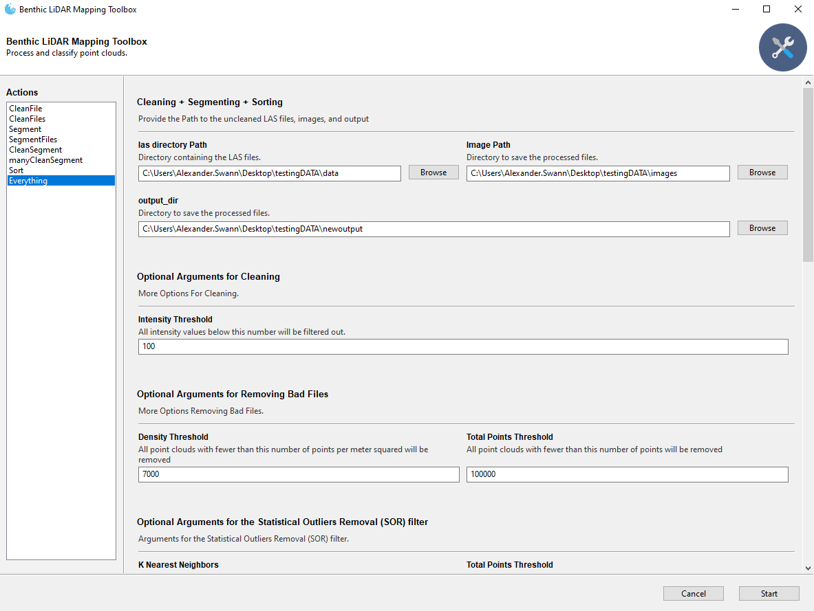

# Benthic (LiDAR) Mapping


---

This project is used to further process LiDAR collected by AUVs in the large MDBC initiative. The data, being referred 
to as "micro bathymetry", is collected using underwater laser scanners with imaging payloads and post-processed by 
[Voyis](https://voyis.com/).

This repo does the following:
- Cleaning Raw Point Clouds
- Segmenting Fish out of Point Clouds
- Segmenting Corals and other organisms out of Point Clouds
- Creating a Sea Floor DEM
- Assign Images to Specific Point Clouds
- Render Images of Point Cloud Track

## Getting Started

Follow the steps below to set up your `anaconda` environment, install dependencies, and run a simple unit test to
validate proper installation.


## Install Part A: Prepare Conda Environment for Install

1a. Install [`minconda`](https://docs.anaconda.com/miniconda/) on your machine if it's not already. 
Then follow the steps below to prepare your conda environment for this Repository's Code:
<br>
<br>

2a. Open `Anaconda Prompt` **NOT** `Anaconda Powershell Prompt` **VERY IMPORTANT**
<br>
The `Anaconda Powershell Prompt` does not consistently work.

3a. Copy this and run, do not change env name
```bash
conda create --name CloudComPy310 python=3.10 -y
```
<br>


4a. Next Activate the CloudComPy310 conda environment
```bash
conda activate CloudComPy310
```
<br>

5a. Now we update conda. If your conda is not up to date this could take a moment
```bash
conda update -n base -c defaults conda -y
```
<br>

6a. Now we add the conda forge channel, this is where we will download our packages from
```bash
conda config --add channels conda-forge
```
<br>

7a. Next we set the channel priority to strict.
```bash
conda config --set channel_priority strict
```
<br>


8a. When installing packages a solver is used to determine the prerequisite packages needed.

The default solver often takes a long time and occasionally fails, so we install the libmamba solver
```bash
conda install -n base conda-libmamba-solver -y
```
<br>

9a. Now we set libmamba as the solver
```bash
conda config --set solver libmamba
```
<br>


10a. To get this repository on your computer we will use git.

This install assumes you do not have git on your computer so we need to install it.
```bash
conda install git -y
```
<br>

# Install Part B: Getting the Repository on your computer

1b. Now cd to where you would like the repository to live.

Commonly GitHub repositories are stored in a folder named GitHub within your Documents folder.


### EXAMPLE: `cd Documents\GitHub`
<br>


2b. Now we use the git clone command to get the repository on your computer
```bash
git clone https://github.com/alexanderswann-noaa/Benthic-LiDAR-Mapping.git
```
<br>

3b. Use the cd command to get into the repository
```bash
cd Benthic-LiDAR-Mapping
```
<br>


4b. Within the repository there is a requirements.txt file with all of the conda packages needed to run the code.

This could take a few minutes.
```bash
conda install --file requirements.txt -y
```
<br>

5b. Run build.py the script
```bash
python build.py
```
<br>

6b. Change directories, enter the CloudComPy310 folder
```bash 
cd build\CloudComPy310
```
<br>

7b. Once in the folder run this script

This script sets specific `PYTHONPATH` varialbes so that python knows where to access CloudComPy
```bash
envCloudComPy.bat
```

The expected output from the `envCloudComPy.bat` file is:

**Checking environment, Python test: import cloudComPy<br>
 Environment OK!**
 <br>

If you do not receive this message, contact [Jordan](https://github.com/Jordan-Pierce) or [Xander](https://github.com/alexanderswann). Finally, update you `PYTHONPATH` to have the directory 
of `CloudCompare`:
<br>
<br>

8b. Return back to main repo folder
```bash
cd..\..
```
<br>


**9b. Update the following to your specific path... (don't just copy and paste)**

For example if your User Profile name is `Alexander.Swann` and you cloned the repo within `Documents\GitHub`
<br>
The code would look like this:
<br>
**EXAMPLE:** `conda env config vars set PYTHONPATH=C:/Users/Alexander.Swann/Documents/GitHub/Benthic-LiDAR-Mapping/build/CloudComPy310/CloudCompare`
<br>
<br>
Fill in `/your.name/...` with your User Profile name and the location of `Benthic-LiDAR-Mapping`
<br>
**Template:** `conda env config vars set PYTHONPATH=C:/Users/your.name/.../Benthic-LiDAR-Mapping/build/CloudComPy310/CloudCompare`
<br>
<br>

10b. Reactivate the CloudComPy310 Conda environment
```bash
conda activate CloudComPy310
```
<br>

# First Time Running the App

Now from the same `Anaconda Prompt` Window, run the app:

```bash
python app.py
```

# Rerunning the App after install

1. Open `Anaconda Prompt` **NOT** `Anaconda Powershell Prompt` **VERY IMPORTANT**!!

The `Anaconda Powershell Prompt` does not consistently work.
<br><br>

2. Next Activate the CloudComPy310 conda environment
```bash
conda activate CloudComPy310
```
<br>


3. cd into the repository.
   
For example if your User Profile name is `Alexander.Swann` and you cloned the repo within `Documents\GitHub`
<br>
The code would look like this:
<br>
**EXAMPLE:** `cd C:/Users/Alexander.Swann/Documents/GitHub/Benthic-LiDAR-Mapping`
<br>
<br>
Fill in `/your.name/...` with your User Profile name and the location of `Benthic-LiDAR-Mapping`
<br>
**Template:** `conda env config vars set PYTHONPATH=C:/Users/your.name/.../Benthic-LiDAR-Mapping`
<br>
<br>

4. Run the App.
```bash
python app.py
```
***
### Potential Issues

1. If you get this error:

```bash

    from _cloudComPy import *
ModuleNotFoundError: No module named '_cloudComPy'
```


Try this:

1a. Change directories, enter the CloudComPy310 folder
```bash 
cd build\CloudComPy310
```
<br>

2a. Once in the folder run this script

This script sets specific `PYTHONPATH` varialbes so that python knows where to access CloudComPy
```bash
envCloudComPy.bat
```

The expected output from the `envCloudComPy.bat` file is:

**Checking environment, Python test: import cloudComPy<br>
 Environment OK!**
 <br>

If you do not receive this message, contact [Jordan](https://github.com/Jordan-Pierce) or [Xander](https://github.com/alexanderswann). Finally, update you `PYTHONPATH` to have the directory 
of `CloudCompare`:
<br>
<br>

3a. Return back to main repo folder
```bash
cd..\..
```
<br>

4a. Rerun the App.
```bash
python app.py
```

***
2. Install Build Issue
2a. After installing the required packages, run the `build.py` script, which **expects that the `binaries` are already in `./build`**; if 
they're not, download them [here](https://www.simulation.openfields.fr/index.php/cloudcompy-downloads/3-cloudcompy-binaries/5-windows-cloudcompy-binaries/106-cloudcompy310-20240613) and place the `.7z` file in the `./build` folder.
<br>


# Updating Repository

To update your local version of the repository to the newest version on GitHub you must run 3 commands.

1. cd into the repository.
   
For example if your User Profile name is `Alexander.Swann` and you cloned the repo within `Documents\GitHub`
<br>
The code would look like this:
<br>
**EXAMPLE:** `cd C:/Users/Alexander.Swann/Documents/GitHub/Benthic-LiDAR-Mapping`
<br>
<br>
Fill in `/your.name/...` with your User Profile name and the location of `Benthic-LiDAR-Mapping`
<br>
**Template:** `conda env config vars set PYTHONPATH=C:/Users/your.name/.../Benthic-LiDAR-Mapping`
<br>
<br>

2. Fetch the newest version of the code from the internet.
```bash
git fetch
```
<br>
   
3. Pull that newest version to your local machine.
```bash
git pull
```
<br>

**Now you are ready to run the newest version of the code!!**
<br>

# Use

Below is an example for how the driving script, `app.py`, can be used:



### Extra

To run SfM on a folder of images, `Metashape` needs to be installed:

```bash
pip install packages/Metashape-2.0.2-cp37.cp38.cp39.cp310.cp311-none-win_amd64.whl
```

The license is expected to be stored as the variable `METASHAPE_LICENSE` on your computer.


## CloudComPy

For more information about CloudComPy click [here](https://github.com/CloudCompare/CloudComPy/blob/master/doc/UseWindowsCondaBinary.md)


