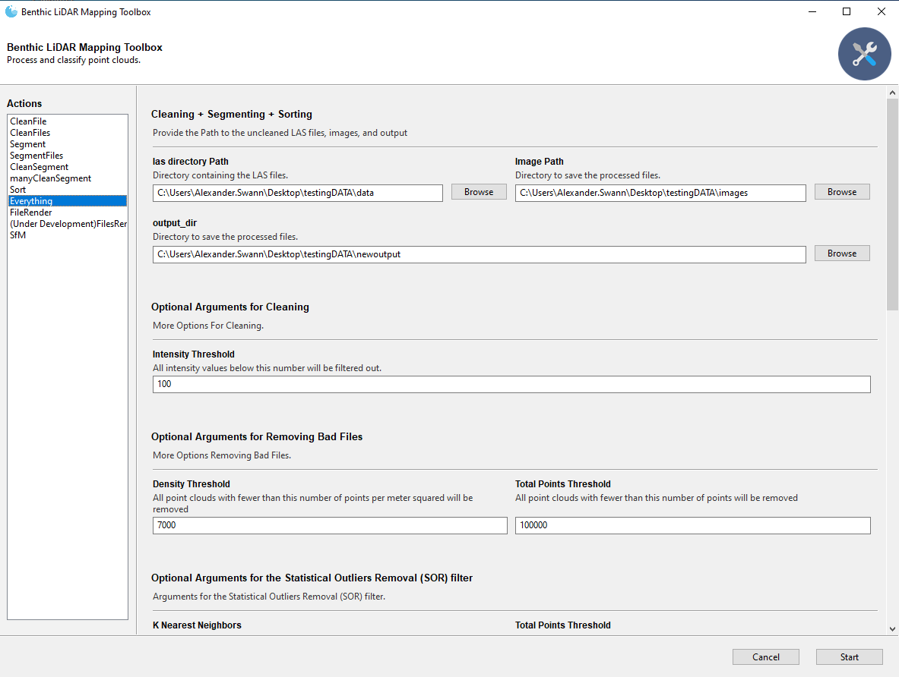

# Benthic (LiDAR) Mapping


---

This project is used to further process LiDAR collected by AUVs in the large MDBC initiative. The data, being referred 
to as "micro bathymetry", is collected using underwater laser scanners with imaging payloads and post-processed by 
[Voyis](https://voyis.com/).

This repo does the follow:
- asdf
- asdf
- asdf
- asdf

## Getting Started

Follow the steps below to set up your `anaconda` environment, install dependencies, and run a simple unit test to
validate proper installation.

### Install

Before getting started, install [`minconda`](https://docs.anaconda.com/miniconda/) on your machine if it's not already. 
Then follow the steps below to install the python dependencies:

```bash
# cmd

# Copy this and run, do not change env name
conda create --name CloudComPy310 python=3.10 -y
conda activate CloudComPy310

conda update -n base -c defaults conda -y
conda config --add channels conda-forge
conda config --set channel_priority strict

conda install -n base conda-libmamba-solver -y
conda config --set solver libmamba

conda install git -y
git clone https://github.com/alexanderswann-noaa/Benthic-LiDAR-Mapping.git
cd Benthic-LiDAR-Mapping

# This will take a while, go grab a cup of coffee ☕
conda install --file requirements.txt -y
```

After this is done, run the `build.py` script, which **expects that the `binaries` are already in `./build`**; if 
they're not, download them [here](https://www.simulation.openfields.fr/index.php/cloudcompy-downloads/3-cloudcompy-binaries/5-windows-cloudcompy-binaries/106-cloudcompy310-20240613) and place the `.7z` file in the `./build` folder.

```bash
# cmd

# Install the dependency 
pip install py7zr
# Run the script
python build.py

# Change directories 
cd build\CloudComPy310
# Run the following
envCloudComPy.bat
```

The expected output from the `envCloudComPy.bat` file is:
```bash
# Expected output:
Checking environment, Python test: import cloudComPy
Environment OK!
```

If you do not receive this message, contact `Jordan` or `Xander`. Finally, update you `PYTHONPATH` to have the directory 
of `CloudCompare`:

```bash
# cmd

# Update the following to your specific path... (don't just copy and paste)
conda env config vars set PYTHONPATH=C:/Users/your.name/.../Benthic-LiDAR-Mapping/build/CloudComPy310/CloudCompare
conda activate CloudComPy310
```

### Running

Now, try running the app:

```bash
# cmd

python app.py
```

### Common Issues

One of the most common issues is getting this error from running `envCloudComPy.bat`:

```bash

    from _cloudComPy import *
ModuleNotFoundError: No module named '_cloudComPy'
```

Luckily this is very easy to fix, Navigate to the `CloudComPy310` folder and run the `envCloudComPy.bat` file. This will 
reset the `PYTHONPATH`s which should make your computer be able to locate the CloudCompare module

```bash
# cmd

cd <path install>\CloudComPy310
envCloudComPy.bat
```
Now running `app.py` and `main.py` should work.

## Use

Below is an example for how the driving script, `app.py`, can be used:



### Extra

To run SfM on a folder of images, `Metashape` needs to be installed:

```bash
# cmd

pip install packages/Metashape-2.0.2-cp37.cp38.cp39.cp310.cp311-none-win_amd64.whl
```

The license is expected to be stored as the variable `METASHAPE_LICENSE` on your computer.